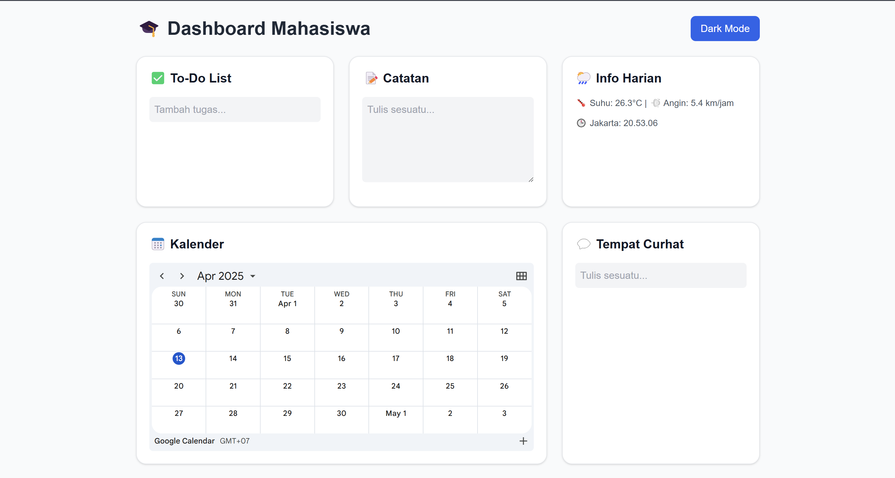

# 🎓 Personal Dashboard Mahasiswa

Dashboard ini dibuat untuk membantu mahasiswa dalam mengatur aktivitas hariannya secara efisien dan interaktif.

## ✨ Fitur Utama
- ✅ **To-Do List** — Tambah dan hapus daftar tugas, disimpan di localStorage
- 📝 **Catatan Markdown** — Buat catatan yang dirender otomatis dalam format Markdown
- 🌤️ **Widget Cuaca** — Info cuaca terkini dari API Open-Meteo
- 🕓 **Jam Dunia** — Tampilkan waktu real-time zona Jakarta
- 📅 **Kalender Google** — Embed Google Calendar kamu sendiri
- 🤖 **Mini ChatGPT** — Simulasi Chat Assistant lokal
- 🌓 **Dark Mode Toggle** — Dukungan tema gelap
- 🔄 **Penyimpanan Otomatis** — Semua data tersimpan otomatis di browser

## 💡 Kreativitas
Aplikasi ini dirancang sebagai **Personal Dashboard Mahasiswa** agar lebih produktif, dengan fitur seperti:
- Pencatatan cepat
- Pengingat tugas
- Akses cuaca dan waktu secara real-time

## 🧠 Implementasi Fitur ES6+
- `let` & `const` digunakan secara konsisten
- ✅ **3+ Arrow Functions**: event listener, render, add/delete todo
- ✅ **Template Literals**: untuk menampilkan list & chat
- ✅ **Async/Await**: pengambilan data cuaca dari API
- ✅ **Class**: `TodoApp` untuk logika to-do list

## 📸 Screenshot

---

> Dibuat untuk Tugas Praktikum [NextGen JavaScript](https://learn-ifitera.vercel.app/pemrograman-web/nextgen-javascript)
