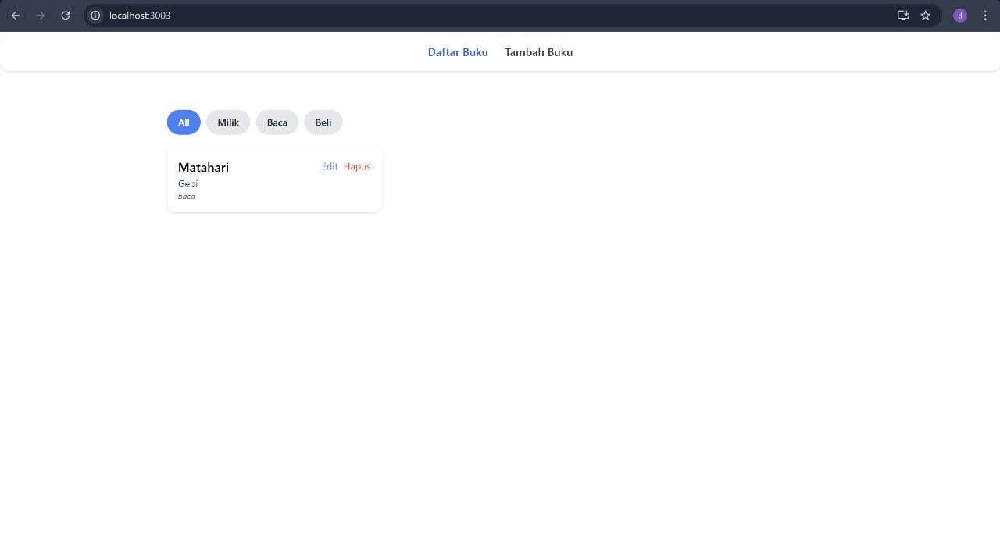

# 📚 Aplikasi Manajemen Buku Pribadi

Aplikasi ini dibuat menggunakan React untuk membantu pengguna mencatat, mencari, menyaring, dan mengelola koleksi buku pribadinya. Cocok untuk pelajar, mahasiswa, atau siapa saja yang suka membaca dan ingin mengelola daftar bukunya secara digital.

## 🚀 Fitur Aplikasi

- Tambah, ubah, dan hapus data buku (CRUD)
- Filter berdasarkan status (Belum dibaca, Sedang dibaca, Selesai)
- Pencarian buku berdasarkan judul
- Navigasi antar halaman menggunakan React Router
- State global menggunakan Context API
- Penyimpanan data lokal dengan localStorage
- Komponen reusable dan custom hooks
- Unit testing dengan React Testing Library
- Desain antarmuka responsif dan modern dengan Tailwind CSS

## 🛠️ Cara Instalasi & Menjalankan

1. Clone repositori ini:

   ```bash
   git clone https://github.com/username/manajemen-buku.git
   cd manajemen-buku
   ```

2. Install dependencies:

   ```bash
   npm install
   ```

3. Jalankan aplikasi:

   ```bash
   npm start
   ```

4. Untuk menjalankan unit test:

   ```bash
   npm test
   ```

## 🖼️ Screenshot Antarmuka

### Halaman Utama


### Form Tambah/Ubah Buku


### Tampilan Mobile


> 📷 Simpan gambar-gambar di folder public/screenshots/ agar link tidak error saat dibuka di GitHub.

## ⚛️ Fitur React yang Digunakan

- ✅ React Hooks: useState, useEffect, useContext, useParams, useNavigate
- ✅ Context API: untuk manajemen global state buku
- ✅ React Router (v7+): untuk navigasi multipage (Home, Tambah/Edit)
- ✅ Custom Hooks: seperti useSearchBooks dan useFilteredBooks
- ✅ Komponen Reusable: BookCard, Layout, Navbar, dll
- ✅ Local Storage: menyimpan data buku agar tetap ada setelah reload
- ✅ Unit Testing: dengan React Testing Library untuk memastikan fungsi berjalan dengan baik
- ✅ PropTypes: validasi props agar komponen lebih robust

---

📬 Jika kamu suka proyek ini, silakan bintangi dan fork ya!
